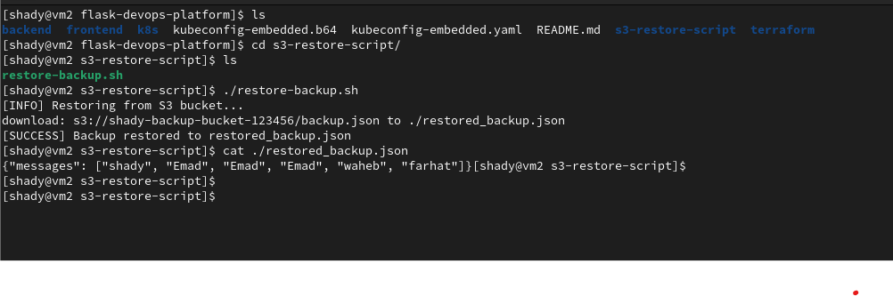

# 🚀 Flask DevOps Platform


A full-stack DevOps project featuring a Flask backend and static frontend, built with Docker and GitHub Actions for CI/CD, includes an AWS S3 restore script, Terraform infrastructure provisioning, and Kubernetes manifests (optional).

---

## 📸 Screenshots

### 🖥️ Frontend  


### ⚙️ Backend Console  


### ♻️ Restore Script in Action  


### 🤖 GitHub Actions Workflow  


> 📂 Place all screenshots in a folder named `images/` at the root of the repository.

---

## 🧾 Project Structure

```
.
├── backend/                  # Flask backend (Dockerized)
│   ├── app.py
│   ├── Dockerfile
│   ├── data.json
│   └── requirements.txt
├── frontend/                 # Static frontend (Dockerized)
│   ├── index.html
│   └── Dockerfile
├── .github/workflows/        # GitHub Actions CI/CD pipeline
│   └── deploy.yml
├── terraform/                # Infrastructure as Code (Terraform)
│   ├── main.tf
│   ├── backend.tf
│   ├── provider.tf
│   └── .terraform.lock.hcl
├── k8s/                      # Kubernetes manifests (optional)
│   ├── backend-deployment.yaml
│   ├── frontend-deployment.yaml
│   └── ingress.yaml
├── s3-restore-script/        # AWS S3 restore utility
│   ├── .env
│   ├── restore-backup.sh
│   └── restored_backup.json
├── images/                   # Project screenshots (not included in code)
└── README.md
```

---

## ✅ Features

- ✅ Flask backend with data served from `data.json`
- ✅ Static HTML frontend
- ✅ Dockerized backend and frontend
- ✅ GitHub Actions for CI/CD pipeline
- ✅ AWS S3 restore script
- ✅ Infrastructure as Code via Terraform
- ✅ Kubernetes manifests 

---

## 🔁 CI/CD Pipeline

GitHub Actions Workflow:
- Triggered on `push` to `main` or manual dispatch
- Builds Docker images for backend and frontend
- Pushes to DockerHub

```yaml
docker build -t shadyemad/flask-devops-platform-backend ./backend
docker build -t shadyemad/flask-devops-platform-frontend ./frontend
docker push shadyemad/flask-devops-platform-backend
docker push shadyemad/flask-devops-platform-frontend
```

> 🚫 Kubeconfig and Kubernetes deployment steps were removed for simplicity

---

## ☁️ AWS S3 Restore Script

Shell script to restore `data.json` backup from AWS S3.

**Run:**

```bash
cd s3-restore-script
bash restore-backup.sh
```

**Configure `.env`:**

```env
AWS_ACCESS_KEY_ID=your_access_key
AWS_SECRET_ACCESS_KEY=your_secret_key
S3_BUCKET_NAME=your_bucket_name
```

---

## 🐳 Docker Images

| Component | DockerHub Repo |
|-----------|----------------|
| Backend   | `shadyemad/flask-devops-platform-backend` |
| Frontend  | `shadyemad/flask-devops-platform-frontend` |

---

## 🔐 GitHub Secrets

| Secret Name           | Description              |
|------------------------|--------------------------|
| `DOCKERHUB_USERNAME`   | Your DockerHub username  |
| `DOCKERHUB_TOKEN`      | DockerHub PAT/token      |

---

## 🛠️ Terraform Usage

```bash
cd terraform
terraform init
terraform apply
```

Creates infrastructure as defined in `main.tf`, `provider.tf`, and `backend.tf`.

---

## ☸️ Kubernetes 

Use the manifests in `k8s/` if you want to deploy manually to a cluster.

```bash
kubectl apply -f k8s/
```

> 🧪 Kubernetes deployment is not handled in the current CI/CD workflow.

---

## 👤 Author

**Shady Emad Wahib Farhat**   
🔗 GitHub: [shadyemad2](https://github.com/shadyemad2)

---

## 📌 Project Status

- ✅ Working CI/CD via GitHub Actions
- ✅ Verified AWS S3 Restore
- ✅ Docker builds and image publishing
- ✅ Kubernetes manifests present (manual)
- ✅ Infrastructure via Terraform

---


